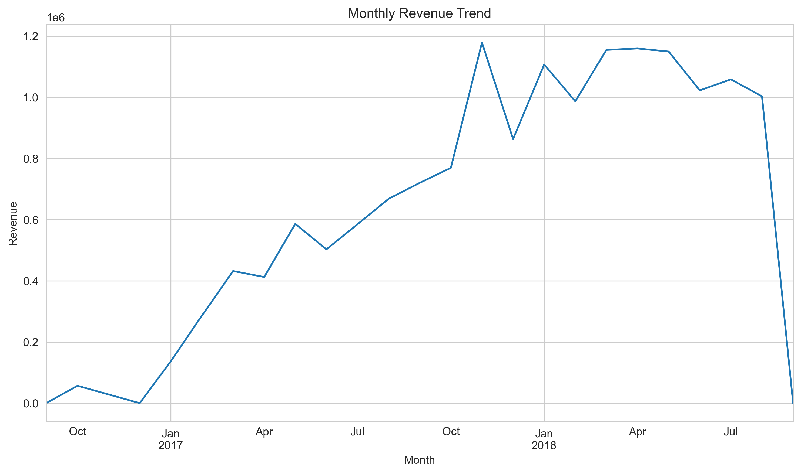
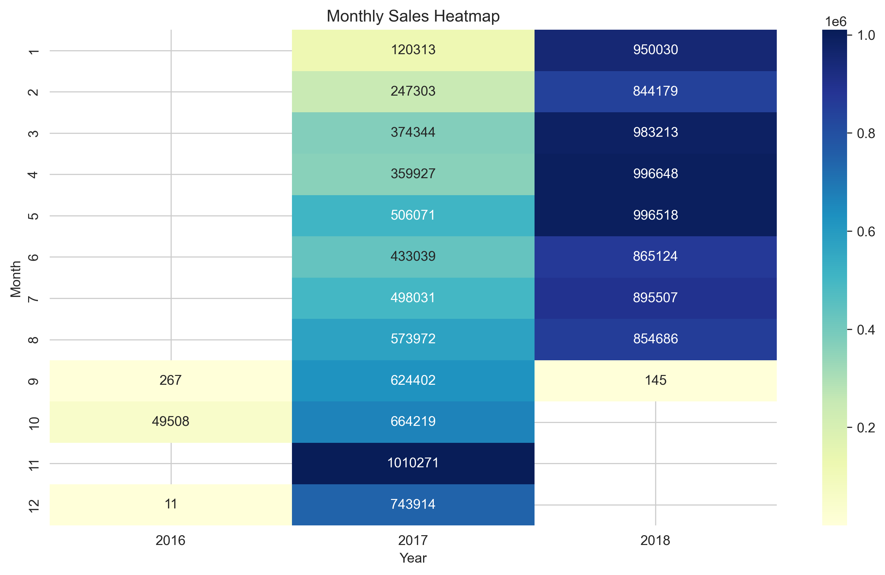
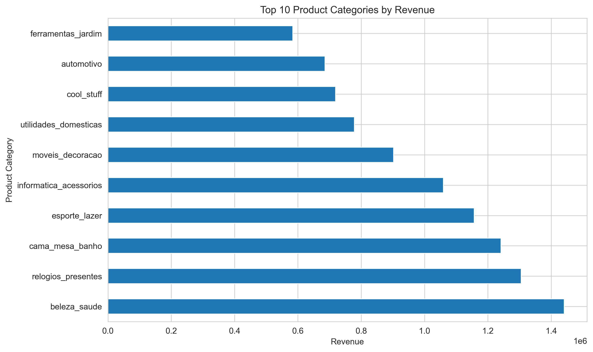
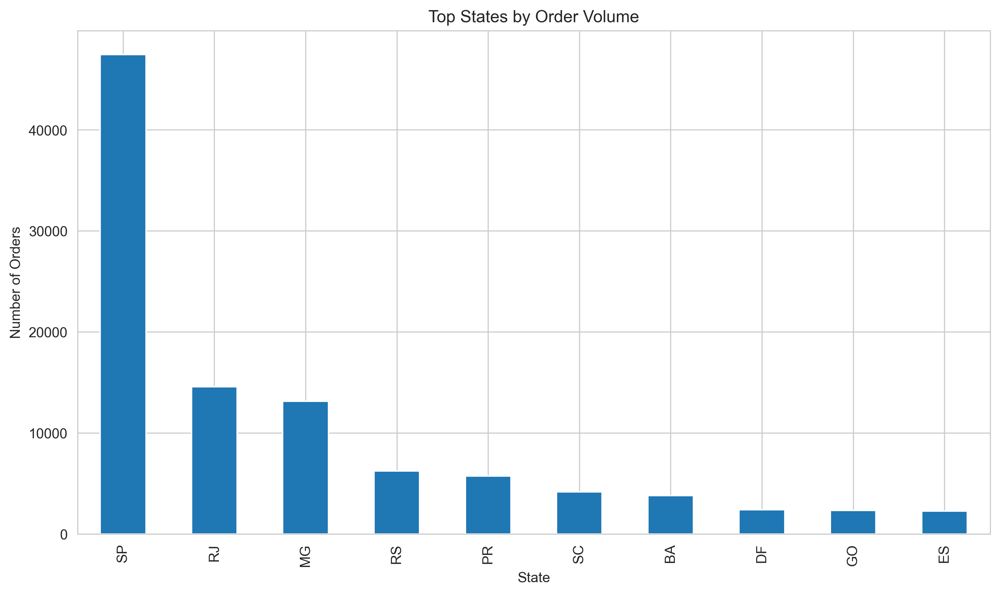
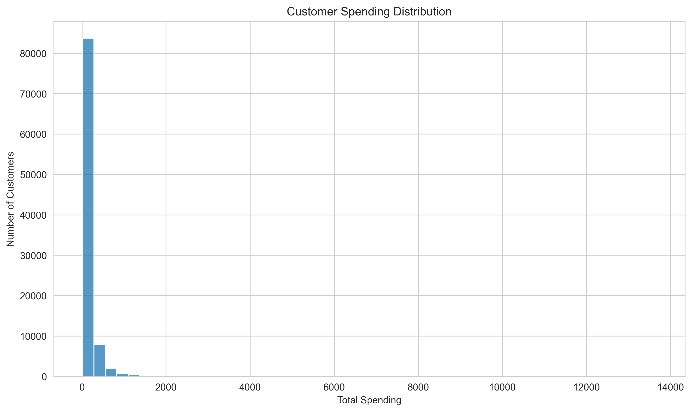
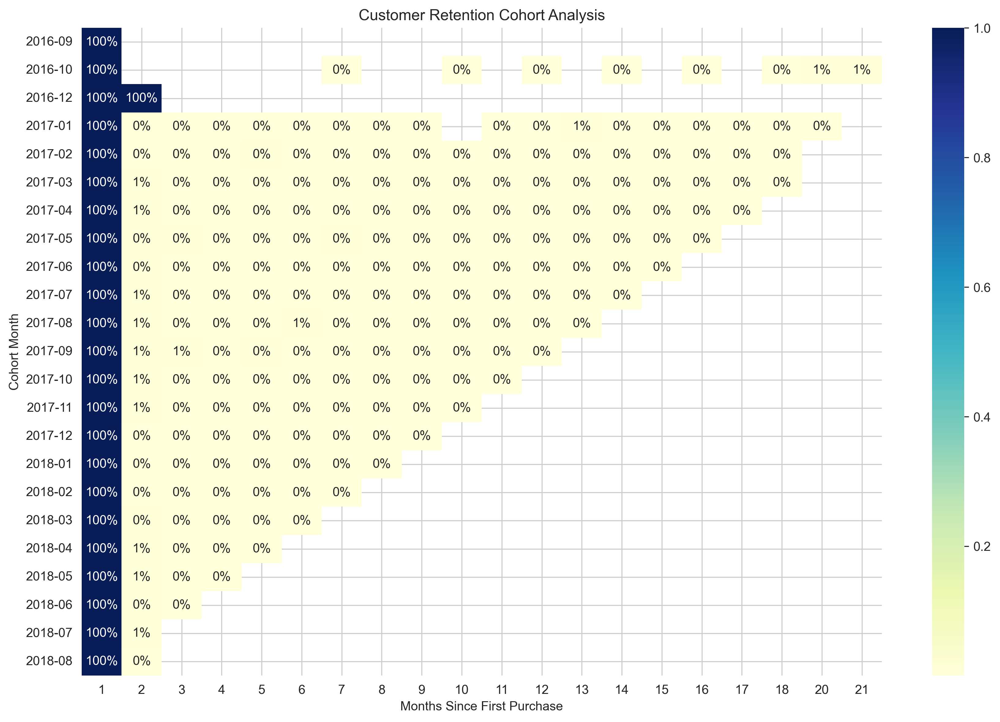

# Brazilian E-Commerce Sales Analysis


Exploratory data analysis of the Brazilian Olist e-commerce dataset to uncover
sales trends, customer behavior, and geographic demand patterns.

This project analyzes over 100,000 e-commerce transactions using Python and
data visualization techniques to generate actionable business insights.

---

# Project Overview

Understanding customer purchasing behavior and sales patterns is critical
for e-commerce platforms to optimize marketing strategies, inventory
management, and logistics operations.

This project explores transactional data from the Olist marketplace to
identify key patterns in:

• revenue growth  
• product demand  
• geographic customer distribution  
• seasonal purchasing behavior  
• customer retention  

The analysis demonstrates how data analytics can be used to support
data-driven business decisions.

---

## Dataset Scale

• 100,000+ orders analyzed  
• Multiple relational datasets merged  
• Thousands of customers and product transactions  

The analysis was conducted using Python-based data analytics tools and
structured exploratory data analysis techniques.

---

# Business Questions

The analysis aims to answer the following questions:

• How have sales evolved over time?  
• Which product categories generate the most revenue?  
• Where are customers geographically located?  
• Are there seasonal purchasing patterns?  
• How well does the platform retain customers?

---

# Dataset

Source:

Brazilian E-Commerce Public Dataset by Olist  
Available on Kaggle.

Tables used in the analysis:

```
orders
order_items
products
customers
```

These relational datasets were merged to construct a unified sales dataset
for analysis.

---

# Methodology

The analysis follows a structured data analytics workflow:

1. Data quality assessment  
2. Data cleaning and preprocessing  
3. Feature engineering  
4. Exploratory data analysis  
5. Visualization of key trends  
6. Customer segmentation and retention analysis  
7. Business insight generation

---

# Key Visualizations

## Monthly Revenue Trend



Revenue shows a clear upward trajectory, indicating increasing platform
adoption over time.

---

## Seasonal Sales Heatmap



The heatmap highlights strong seasonal demand patterns, with sales peaking
during the final quarter of the year.

---

## Top Product Categories



A small number of product categories generate a large share of revenue,
indicating concentrated product demand.

---

## Orders by State



Customer demand is geographically concentrated in several major Brazilian
states.

---

## Order Value Distribution



Most purchases involve relatively low transaction values, while a smaller
number of orders account for higher spending.

---

## Customer Retention Cohort Analysis



Cohort analysis reveals that customer retention declines after the first
purchase, suggesting opportunities to improve repeat engagement.

---

# Key Insights

• Sales demonstrate clear seasonal patterns with strong growth toward the
end of the year.

• Revenue is concentrated in a limited number of product categories.

• Customer demand is geographically clustered in major Brazilian states
and metropolitan areas.

• Most customers make relatively small purchases, while a minority of
customers generate a large portion of total revenue.

• Customer retention drops significantly after the first purchase,
highlighting the importance of loyalty and re-engagement strategies.

---

# Business Impact Analysis

The insights generated from this analysis can directly support strategic
decision-making for an e-commerce platform.

### Marketing Strategy
Seasonal demand patterns indicate strong purchasing activity during the
final quarter of the year. Marketing campaigns and promotional events
should be strategically intensified during these periods to maximize
customer engagement and revenue.

### Inventory Management
Revenue concentration within a limited number of product categories
suggests that inventory planning should prioritize these high-demand
segments to prevent stock shortages during peak sales periods.

### Logistics Optimization
Geographic demand analysis shows that customer orders are heavily
concentrated in several major Brazilian states. Expanding logistics
infrastructure and fulfillment capabilities in these regions could
significantly improve delivery efficiency.

### Customer Retention
Cohort analysis indicates that many customers make only a single
purchase. Implementing loyalty programs and personalized marketing
strategies could improve repeat purchasing behavior and increase
customer lifetime value.

---

# Business Recommendations

Based on the analysis, several strategic opportunities emerge:

• Increase marketing campaigns during seasonal peak periods to maximize
revenue.

• Prioritize inventory management for high-performing product categories.

• Expand logistics infrastructure in high-demand regions to reduce
delivery times.

• Implement customer loyalty programs and targeted promotions to improve
customer retention.

---

# Repository Structure

```
brazilian-ecommerce-sales-analysis

data/
notebooks/
visualizations/
README.md
requirements.txt
```

---

# Tools Used

Python  
Pandas  
NumPy  
Matplotlib  
Seaborn  
Plotly  
Geopandas  
Jupyter Notebook

---

# Future Work

Potential extensions of this analysis include:

• predictive sales forecasting  
• customer lifetime value modeling  
• delivery time and logistics analysis  
• sentiment analysis of customer reviews
